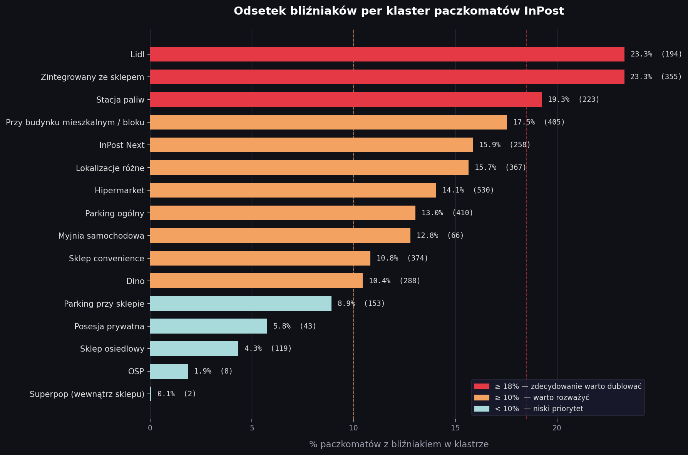
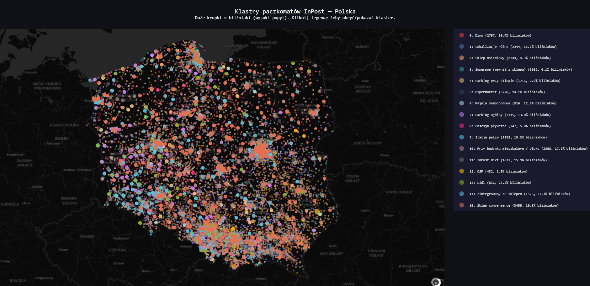
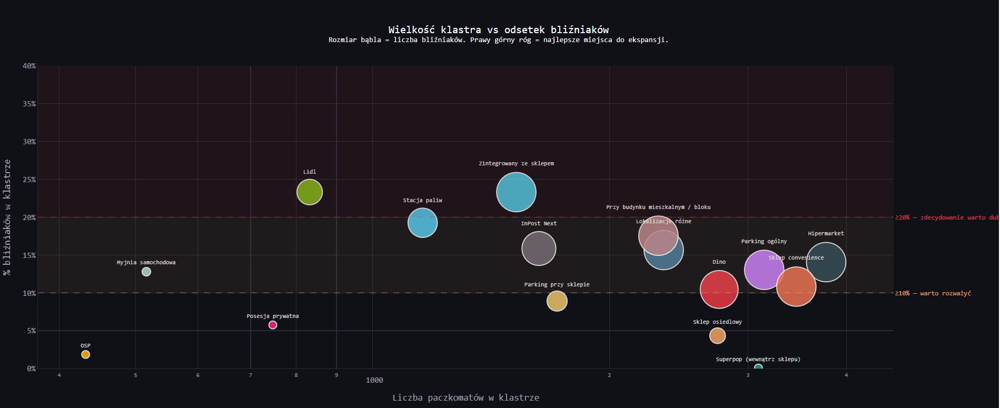
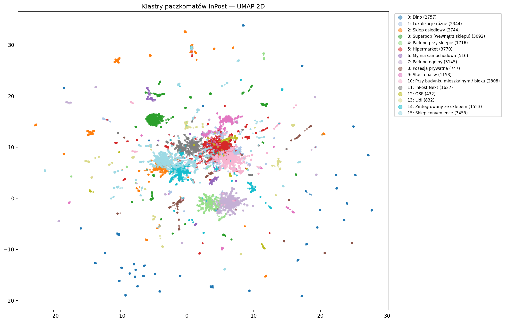

# InPost Parcel Locker Expansion Intelligence

## Author

- **Name:** [Daminika Dzeranhouskaya]
- **Email:** [damjnjka@gmail.com]

## Overview

This project analyzes the entire InPost parcel locker network in Poland (32,166 points)
to identify **where demand for new lockers is highest**. By clustering lockers based on
their location descriptions and detecting "twin" lockers — locations where InPost already
placed two machines side by side — I built a data-driven signal for expansion priority
across 16 location archetypes.

## Demo & Description

### The core idea: twins as a demand signal

InPost sometimes installs two parcel lockers at the same location. I treat these
**"twin" lockers as a revealed preference** — if InPost doubled up somewhere, demand
was high enough to justify it. This gives us a clean, observable proxy for demand
without needing transaction data.

### What I built

A full data pipeline from raw API → embeddings → clusters → business insights:

1. **Data collection** (`00_prepare_data.py`)  
   Fetches all Polish InPost points from the live API, caches results locally.

2. **Text embeddings** (`01_build_embeddings.py`)  
   Encodes each locker's location description using a multilingual sentence transformer,
   capturing semantic meaning of Polish location text.

3. **Feature engineering** (`02_build_features.py`)  
   Combines embeddings with structured features: indoor flag, 24/7 availability,
   machine type, coordinates.

4. **Clustering** (`03_cluster.py`)  
   K-Means (k=16) on the combined feature space. Number of clusters selected by
   iterative elbow analysis and manual coherence review across k=12–17.

5. **Cluster description** (`04_describe_clusters.py`)  
   Generates a human-readable summary of each cluster: top location descriptions,
   machine type distribution, indoor/24h rates, twin rates, and regional breakdown.

6. **Visualizations** (`05`, `06`, `07a/b/c`)  
   - UMAP 2D projection of all lockers, colored by cluster  
   - Elbow curve for k selection  
   - Bar chart: twin rate per cluster (expansion priority ranking)  
   - Interactive map of Poland with all lockers (Folium)  
   - Interactive bubble chart: cluster size vs twin rate (Plotly)

### The 16 location archetypes

| Cluster | Name | Twin rate |
|---|---|---|
| 13 | Lidl | 23.3% 🔴 |
| 14 | Zintegrowany ze sklepem | 23.3% 🔴 |
| 9  | Stacja paliw | 19.3% 🔴 |
| 10 | Przy budynku mieszkalnym / bloku | 17.5% 🟠 |
| 11 | InPost Next | 15.9% 🟠 |
| 1  | Lokalizacje różne | 15.7% 🟠 |
| 5  | Hipermarket | 14.1% 🟠 |
| 7  | Parking ogólny | 13.0% 🟠 |
| 6  | Myjnia samochodowa | 12.8% 🟠 |
| 15 | Sklep convenience | 10.8% 🟠 |
| 0  | Dino | 10.4% 🟠 |
| 4  | Parking przy sklepie | 8.9% 🔵 |
| 8  | Posesja prywatna | 5.8% 🔵 |
| 2  | Sklep osiedlowy | 4.3% 🔵 |
| 12 | OSP | 1.9% 🔵 |
| 3  | Superpop (wewnątrz sklepu) | 0.1% 🔵 |

### Key finding

**Lidl and store-integrated lockers** (lockers physically attached to or inside a store
entrance) have the highest twin rate at 23.3% — meaning nearly 1 in 4 locations already
has a second machine. **Fuel stations** follow at 19.3%, likely driven by high footfall
and 24/7 accessibility. **Residential buildings** rank surprisingly high at 17.5%,
suggesting strong last-mile demand in urban housing areas.

### Interactive visualizations

- 🗺️ [Interactive map — all lockers clustered across Poland](https://DaminikaDz.github.io/InPost-Technology/07b_map.html)
- 📊 [Bubble chart — cluster size vs twin rate](https://DaminikaDz.github.io/InPost-Technology/07c_scatter.html)

### Screenshots

**Twin rate ranking by cluster**


**Cluster map — Poland**


**Cluster size vs twin rate**


**UMAP 2D projection**


## Technologies

| Tool | Purpose |
|---|---|
| `requests` | Fetching data from InPost API |
| `sentence-transformers` | Multilingual text embeddings for location descriptions |
| `scikit-learn` | K-Means clustering, preprocessing |
| `umap-learn` | 2D dimensionality reduction for visualization |
| `folium` | Interactive map of Poland |
| `plotly` | Interactive bubble chart |
| `matplotlib` | Static charts (twin ranking bar chart, elbow curve) |
| `pandas` / `numpy` | Data wrangling |

Sentence transformers were chosen over simpler TF-IDF because Polish location
descriptions contain rich semantic variation ("przy wejściu do sklepu" vs "boczna
ściana sklepu") that bag-of-words approaches flatten into noise.

## How to run

### Prerequisites

- Python 3.10+
- Internet connection (API fetch on first run)

### Build & run

```bash
git clone https://github.com/TWOJNICK/InPost-Technology.git
cd InPost-Technology

pip install -r requirements.txt

# 1. Fetch data from InPost API (~32k points, cached locally after first run)
python 00_prepare_data.py

# 2. Build text embeddings (slow on first run, cached)
python 01_build_embeddings.py

# 3. Engineer features
python 02_build_features.py

# 4. Cluster
python 03_cluster.py

# 5. Describe clusters
python 04_describe_clusters.py

# 6. Visualizations
python 05_visualize_umap.py
python 06_elbow.py
python 07a_twin_ranking.py
python 07b_map.py        # outputs 07b_map.html
python 07c_scatter.py    # outputs 07c_scatter.html
```

All heavy outputs (embeddings, cluster labels) are cached — subsequent runs are fast.

## What I would do with more time

1. **Geographic twin analysis** — are twins concentrated in specific voivodeships?
   Which regions are underserved relative to their twin signal?
2. **Temporal dimension** — the API exposes `location_date`. Tracking when twins
   appeared could reveal InPost's expansion velocity per archetype.
3. **Regression model** — predict twin probability from raw features (coordinates,
   machine type, location type) without clustering as an intermediate step.
4. **Interactive cluster explorer** — let users filter the map by cluster and twin
   status simultaneously, not just by cluster.
5. **Better handling of cluster 1** ("Lokalizacje różne") — this is a catch-all
   cluster that K-Means couldn't cleanly separate. HDBSCAN would likely dissolve
   it into more coherent groups.

## AI usage

I used Claude (Anthropic) extensively throughout this project:

- **Cluster interpretation** — after each K-Means run, I pasted cluster summaries
  and asked Claude to evaluate coherence and suggest better k values. The final k=16
  emerged from ~5 iterations of this loop.
- **Naming clusters** — Claude helped translate raw frequency distributions into
  business-readable names ("Zintegrowany ze sklepem", "Sklep convenience" etc.).
- **Code review** — visualization code and the twin detection logic were reviewed
  and refined with Claude's help.

All outputs were manually verified — I read every cluster summary, checked that names
matched content, and ran the pipeline end to end myself. The analytical framing
(twins as demand signal) was my own idea.

## Anything else?

The "twin as demand signal" concept is the core intellectual bet of this project.
It's an indirect proxy — InPost might place twins for operational reasons unrelated
to demand (e.g. replacing an old machine while keeping the new one). But at 32k
data points, idiosyncratic noise should average out, and the pattern across clusters
is too consistent to be random.

One genuinely surprising finding: **Superpop machines (inside stores, not 24/7)
have a 0.1% twin rate** — essentially zero. This makes sense in hindsight: you can't
put two machines inside a small shop, and the Superpop format is constrained by
indoor space. The clustering picked this up purely from text embeddings, without
any explicit indoor flag in the model.

The interactive map is just a starting point. The natural next step of this concept 
is to combine each locker's text embedding with its geographic coordinates and train 
a spatial model that predicts **where on the map the next twin should be placed** — 
not just which cluster type is worth doubling, but the exact location. This would 
turn a descriptive analysis into an actionable site-selection tool.
